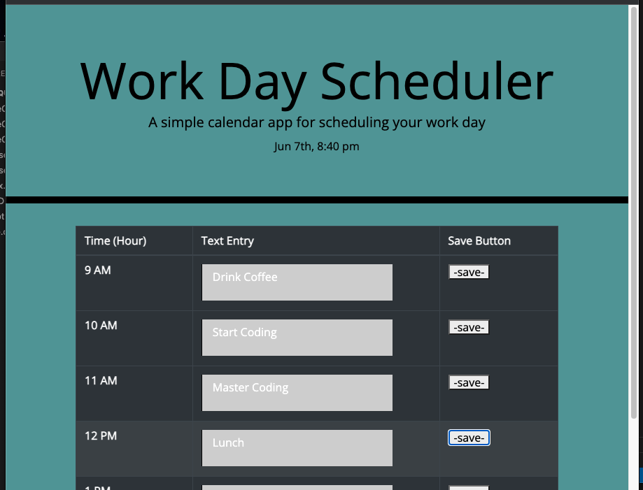

# Day_Scheduler_5.1

## Title: Work Day Scheduler
 

## Description:
This is a simple calendar app for scheduling your work day. You can save tasks, and to make sure you stay on task- this app will automatically change colors as the work day progresses: Grey for past, Red for present, and Green for Future.
  

## Links:  
repo: https://github.com/xnd0/Day_Scheduler_5.1
 
live: https://xnd0.github.io/Day_Scheduler_5.1/
  

## Screenshots:

 

## Technologies Used:
Javascript, CSS, and HTML